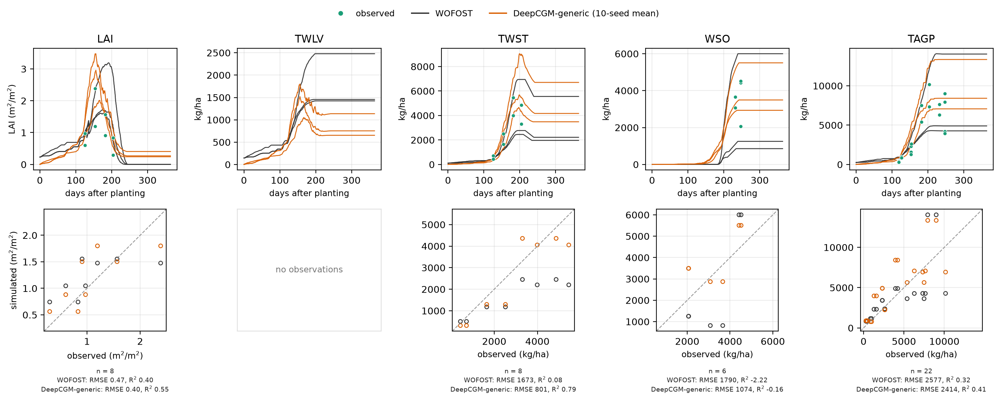

# DeepCGM-generic

[](https://creativecommons.org/licenses/by-nc/4.0/)

A pretrained deep-learning crop growth model for wheat that can be adapted to a
**new cultivar by fitting 32 numbers**.

DeepCGM-generic couples the differentiable crop model DeepCGM with a
Hyper-LoRA cultivar module: a per-cultivar embedding is fed to a hypernetwork
that emits a low-rank update for the model's growth gates. Adapting to a new
cultivar therefore does not retrain the network — it only optimises that
cultivar's 32-dimensional embedding, which is the deep-learning analogue of
calibrating cultivar parameters in a process-based model such as WOFOST.

You supply daily weather, management and phenology, plus whatever observations
you have; fine-tuning fits the embedding in a couple of minutes on a laptop,
and the model then simulates LAI and the biomass of leaves, stems, storage
organs and the whole shoot for any season. The weights, the input scaler they
require, the scripts and a small open dataset to try it on all ship here.

This repository accompanies:

> Han, J. and Athanasiadis, I. N. *Deep learning-based crop models for
> efficient adaptation across cultivars.*

---

## Install

This release lives on the `DeepCGM-generic` branch of the DeepCGM repository;
the `main` branch holds the code of the earlier DeepCGM paper and is unrelated.

```bash
git clone -b DeepCGM-generic https://github.com/WUR-AI/DeepCGM.git
cd DeepCGM
pip install -r requirements.txt
```

Python ≥ 3.9 and PyTorch ≥ 1.13. CPU is enough — the demo below runs in about
a minute on a laptop.

---

## Quickstart

The demo cultivar is **Nefer**, a durum wheat. It was never seen during
pretraining; 13 of its plot-seasons (sown 2005–2006) are the fine-tuning split
and 6 more (sown 2011–2012) are held out for testing.

```bash
# 1. fine-tune Nefer's embedding on the 13 fine-tuning plot-seasons
python scripts/finetune.py --data data/demo_nefer --output outputs/demo_finetuned

# 2. simulate the 6 held-out seasons and score them
python scripts/predict.py --data data/demo_nefer --checkpoint outputs/demo_finetuned \
    --split test --output outputs/demo_test --plot
```

Step 1 takes about two minutes on a laptop and optimises 32 parameters. Step 2
prints per-variable R², RMSE and nRMSE and writes `predictions.csv`,
`metrics.json` and one figure per plot-season.

### Comparing against a process-based model

The demo also ships WOFOST simulations of the same seasons. This uses the
ensemble of ten seeds and needs no fine-tuning — the shipped embedding table
already contains a fitted Nefer vector:

```bash
python scripts/plot_cultivar_summary.py --data data/demo_nefer \
    --ensemble checkpoints/ensemble_e32_r2 \
    --wofost data/demo_nefer/wofost_predictions.csv \
    --split test --output outputs/nefer/fig_nefer_test
```



Top row: simulated trajectories for the six held-out plot-seasons with the
observations on top. Bottom row: the same observations against the matching
simulated value, with RMSE and R² underneath. Leaf biomass was never measured
in these seasons, so the second column has a curve but nothing to score it
against.

### The same thing from Python

```python
from deepcgm import DeepCGMGeneric, CultivarIndex, load_dataset

model = DeepCGMGeneric.from_pretrained()
index = CultivarIndex.from_checkpoint(
    "checkpoints/deepcgm_generic_e32_r2/cultivars.json")
batch = load_dataset("data/demo_nefer", model.input_scaler,
                     model.config.output_scale, index)

prediction = model.predict(batch.drivers, batch.cultivar_ids)   # [n, 365, 6]
# columns: DVS, LAI (m2/m2), TWLV, TWST, WSO, TAGP (kg/ha)
```

---

## Using your own data

Put three CSV files in a directory (see [docs/data_format.md](docs/data_format.md)
for the full column list and units):

```
my_data/
├── plots.csv         uid, cultivar, planting_date, split, ...
├── drivers.csv       uid, date, IRRAD, TMIN, TMAX, RAIN, irr, fer, DVS
└── observations.csv  uid, date, DVS, LAI, TWLV, TWST, WSO, TAGP   (sparse)
```

Then:

```bash
python scripts/finetune.py --data my_data --output outputs/my_model
python scripts/predict.py  --data my_data --checkpoint outputs/my_model \
    --split test --output outputs/my_results
```

Four things behave in ways you may not expect, each explained in
[docs/notes.md](docs/notes.md):

- **DVS is an input you must provide.** The model is told the development stage
  each day; obtain the DVS column from a calibrated WOFOST/PCSE run. The model
  does not synthesise it.
- **Observations may be as sparse as you like.** The loss is masked.
- **Cultivar names are matched against the checkpoint.** Known names reuse their
  fitted embedding; new ones start from zero.
- **Batch composition changes the result.** Fine-tuning cultivars together does
  not give the same embeddings as fine-tuning them one at a time.

---

## Pretraining from scratch

The code for **both** stages of the paper is here: `scripts/pretrain.py` trains
the backbone, hypernetwork and embeddings from scratch, `scripts/finetune.py`
adapts the result to a new cultivar.

```bash
python scripts/pretrain.py --data <multi-cultivar dataset> --output checkpoints/my_pretrained
python scripts/finetune.py --checkpoint checkpoints/my_pretrained --data <new cultivars> --output outputs/adapted
```

**The paper's pretraining run cannot be reproduced from this repository.** The
258 plot-seasons from 45 cultivars behind the released weights come from four
sources whose licences do not all permit redistribution, so the assembled
dataset is not here; what ships instead is its result, the weights in
`checkpoints/`. The four sources are listed in the paper's Code and Data
Availability section. The script is shipped so the procedure is inspectable and
re-usable on data of your own, not because it runs out of the box — pointing
`--data` at a directory that does not exist says so explicitly. WOFOST is not
included either; it is available through
[PCSE](https://github.com/ajwdewit/pcse).

`python scripts/pretrain.py --dry-run` prints the architecture and optimiser
setup without any data. What pretraining does differently from fine-tuning is
in [docs/notes.md](docs/notes.md#what-pretraining-does-differently).

---

## The released checkpoint

`checkpoints/deepcgm_generic_e32_r2/`

| file | what it is |
| --- | --- |
| `backbone.pt` | DeepCGM growth gates (~20k parameters), frozen during fine-tuning |
| `hypernetwork.pt` | embedding → LoRA update, a single `Linear(32, 1360)`, frozen |
| `cultivar_embeddings.pt` | 200 × 32 embedding table; 62 rows are fitted cultivars |
| `cultivars.json` | row index → cultivar name |
| `input_scaler.json` | the training-set mean/scale the drivers must be standardised with |
| `config.json` | architecture and preprocessing constants |

`checkpoints/ensemble_e32_r2/seed_0` … `seed_9` are the same ten models whose
mean the paper reports; `seed_4` is byte-identical to the default checkpoint.
Load them with `Ensemble.from_directory`.

**Use the ensemble when accuracy matters** — averaging the ten seeds is
measurably better than any single run, at ten times an already negligible
inference cost. How `d_emb = 32, r = 2` was selected, and what to expect from a
single seed, are in [docs/model_card.md](docs/model_card.md).

---

## Repository layout

```
deepcgm/            the model and its data plumbing
  models/           CultivarEmbedding.py, EmbeddingToLoRA.py, DeepCGM_LoRA.py
  data.py           CSV -> tensors, cultivar-name bookkeeping
  losses.py         masked weighted MSE + convergence loss
  metrics.py        R2 / RMSE / nRMSE
  scaling.py        the frozen input scaler
  ensemble.py       averaging several seeds, as the paper does
scripts/            pretrain.py, finetune.py, predict.py,
                    plot_cultivar_summary.py, plot_timeseries.py
checkpoints/        deepcgm_generic_e32_r2/ (the released model)
                    ensemble_e32_r2/seed_0..9/ (the 10 seeds of the paper)
data/demo_nefer/    19 open plot-seasons of cultivar Nefer
docs/               data_format.md, model_card.md, notes.md, the demo figure
```

---

## Citing

See [CITATION.cff](CITATION.cff). If you use the pretrained weights, please
cite the paper above; if you use the demo data, also cite its original source
(listed in [data/demo_nefer/README.md](data/demo_nefer/README.md)).

## License

Code and released weights: **CC BY-NC 4.0**, matching the
[DeepCGM repository](https://github.com/WUR-AI/DeepCGM). See [LICENSE.md](LICENSE.md);
for commercial licensing, contact hanjingye@whu.edu.cn.

Demo data: **CC BY 4.0** — more permissive, and deliberately so. `data/demo_nefer/`
is a modified subset of
[doi:10.5281/zenodo.8081577](https://doi.org/10.5281/zenodo.8081577) by Gaudio
et al., whose license permits commercial use and forbids adding restrictions,
so the NonCommercial term above does not extend to it. The modifications,
including the removal of all site information, are listed in
[data/demo_nefer/README.md](data/demo_nefer/README.md). Keep the attribution if
you redistribute it.
